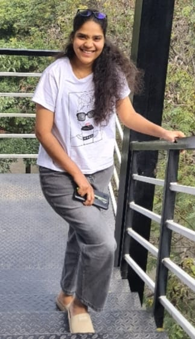
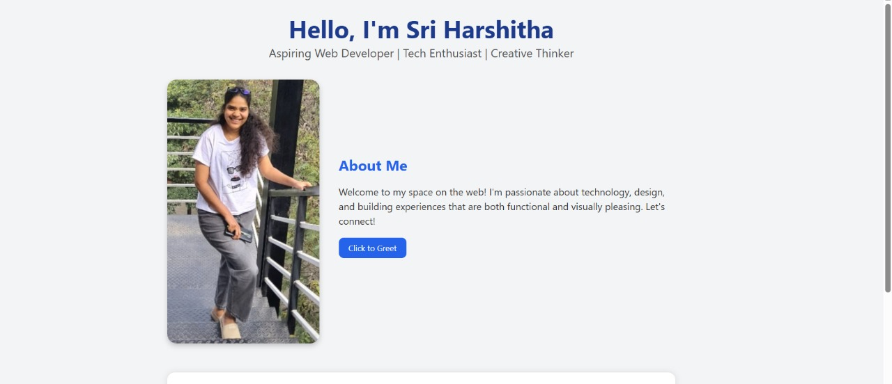
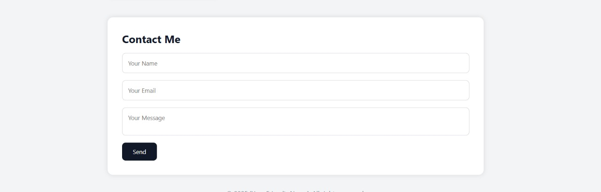

# 👩‍💻 Personal Web Profile – Project Overview

Welcome! This project is a beautifully designed **personal profile webpage**, built to reflect both personality and professional polish. Created using **HTML**, **CSS**, and **JavaScript**, this webpage includes a short intro, a custom contact form, and a friendly interactive greeting.

---

## 🎯 Project Goals

- Build a **responsive and visually appealing** personal website.
- Practice and showcase skills in **web technologies** by blending content, styling, and behavior seamlessly.

---

## 🔧 Technologies & Tools Used

| Tool               | Purpose                                  |
|--------------------|------------------------------------------|
| HTML5              | Webpage structure and content            |
| CSS3               | Styling, layout, responsiveness          |
| JavaScript         | Greeting interaction (click-to-greet)    |
| Visual Studio Code | Code development and management          |
| Web Browser        | Live preview and testing                 |

---

## 🧱 What Was Done

### 🖼️ Page Elements

- A clean and simple **header**
- A **personal image** (see below)
- A brief, professional **bio**
- A **contact form** styled with care
- An interactive **greeting button**

### 🎨 Styling

- Responsive layout using **CSS3**
- Consistent spacing and design aesthetics
- Styled form elements and buttons

### 🧠 Scripting

- A greeting message appears when the user clicks a button
- Code is modular and clearly separated:
  - `index.html` for structure
  - `style.css` for appearance
  - `script.js` for interactivity

---

## 🖼️ Profile Preview

> Here’s the image used as the profile picture on the webpage:

---

## 🧪 Result

Screenshots of the final result:

- **Main Page**
  

- **Contact Form**
  

